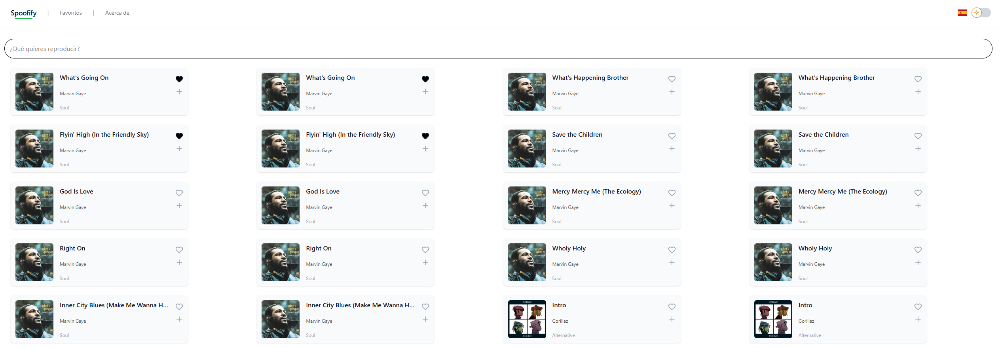
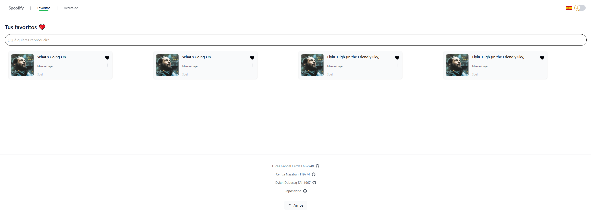

# PWA-backend

Backend de la aplicación desarrollado con Node.js, Express, Prisma ORM y PostgreSQL.

## 🚀 Instalación y ejecución

1. Ingresar a la carpeta del proyecto:

```bash
cd PWA-backend
```

2. Instalar las dependencias:

Express:
```bash  
npm install
npm install express
npm install cors
npm install -D nodemon
```   
Prisma:
```bash 
   npm install @prisma/client dotenv
   npm install @prisma/adapter-pg pg
   npx prisma init
```
Swagger:
```bash 
   npm install swagger-ui-express swagger-jsdoc
```
Bcrysptjs:
```bash 
   npm install bcryptjs
```
JWT (tokens):
```bash 
   npm install jsonwebtoken
```

3. Configurar variables de entorno:

Crear un archivo .env en la raíz del proyecto:

```bash 
  DATABASE_URL="postgresql://neondb_owner:xxxxxx:xxxxxx@host:5432/database"
```

4. Generar el cliente Prisma:
   
```bash
  npx prisma generate
```
5. Ejecutar el servidor en modo desarrollo:
   
```bash 
   npm run dev
```

6. Verificar que el servidor esté funcionando:
   
```bash  
   http://localhost:5000/health
```

Respuesta esperada:

```json 
{
  "status": "ok"
}
```

## 📦 Dependencias principales

* Express: Framework para crear la API REST.
* Prisma ORM: Acceso y gestión de la base de datos.
* PostgreSQL: Sistema gestor de base de datos.
* Cors: Permite solicitudes desde otros dominios (frontend).
* Dotenv: Gestión de variables de entorno.
* Nodemon: Reinicia automáticamente el servidor al detectar cambios.
  
## 📁 Estructura del proyecto

```bash
PWA-backend/
├── prisma/
│   ├── schema.prisma
│   └── migrations/
├── src/
│   ├── config/
│   ├── controllers/
│   ├── lib/
│   ├── middlewares/
│   ├── utils/
│   └── app.js
├── .env
├── package.json
└── server.js
```

## 🛠 Funcionalidades implementadas

* CRUD completo de canciones.
* Gestión de favoritos.
* Integración con PostgreSQL mediante Prisma.
* Middleware global de manejo de errores.
* Middleware para rutas inexistentes (404).
* Validación de datos en solicitudes POST y PUT.
* Respuestas consistentes en formato JSON.
* Soporte para CORS.

## 🔐 Autenticación y usuarios (NUEVO)
* Registro de usuarios (/auth/register)
* Login de usuarios (/auth/login)
* Logout (/auth/logout)
* Endpoint de sesión actual (/auth/me)
* Autenticación con JWT
* Middleware de protección de rutas
* Implementación de refresh token (BONUS)
* Persistencia de sesión segura

## 👤 Modelo de usuario (Prisma)
* Creación de entidad User en Prisma
* Relación entre:
      User ↔ Favorites
      User ↔ Songs (favoritos por usuario)

## ❤️ Favoritos (refactorizado)
* GET /favorites filtrado por usuario autenticado
* POST /favorites/:id asociado a usuario
* DELETE /favorites/:id por usuario
* Relación correcta User–Favorites en base de datos

## 🔒 Seguridad
* Protección de endpoints con JWT middleware
* Validación de token en requests privados
* Control de acceso a rutas sensibles
* Manejo de expiración de sesión con refresh token

## 📡 Endpoints principales

 ### Health Check

```bash
   GET /health
```

### Auth
```bash
   POST /auth/register
   POST /auth/login
   POST /auth/logout
   GET  /auth/me
   POST /auth/refresh
```
 ### Canciones

```bash
   GET /songs
   GET /songs/:id
   POST /songs
   PUT /songs/:id
   DELETE /songs/:id
```

 ### Favoritos (por usuario)

```bash
   GET /favorites
   POST /favorites
   DELETE /favorites/:id
```
## 🗄 Base de datos
* Entidad User agregada
* Relación con favoritos
* Campos automáticos:
      - createdAt
      - updatedAt

## 🔒 Validaciones

Las operaciones de creación y actualización incluyen:

- No se permiten objetos vacíos.
- No se permiten strings vacíos.
- Se devuelve HTTP 400 con mensajes descriptivos cuando los datos son inválidos.
 
## ⚠️ Manejo de errores

El proyecto implementa:

- Middleware global de errores.
- 404 para rutas inexistentes.
- Respuestas de error consistentes.
- Prevención de caídas del servidor ante errores controlados.


## 📷 Nuestra API




## 👩‍💻 Integrantes
    Cyntia Nasabun
    Lucas Gabriel Cerda
    Dylan Duboscq

---

## 📎 Repositorio

    https://github.com/DuboscqDylan/PWA-backend.git

## 📎 Linear

    https://linear.app/pwa-cerda-duboscq/project/tp3-express-6f9dd05b9a8b/overview

## 📎 Vercel

    https://react-tp2-grupo16.vercel.app/